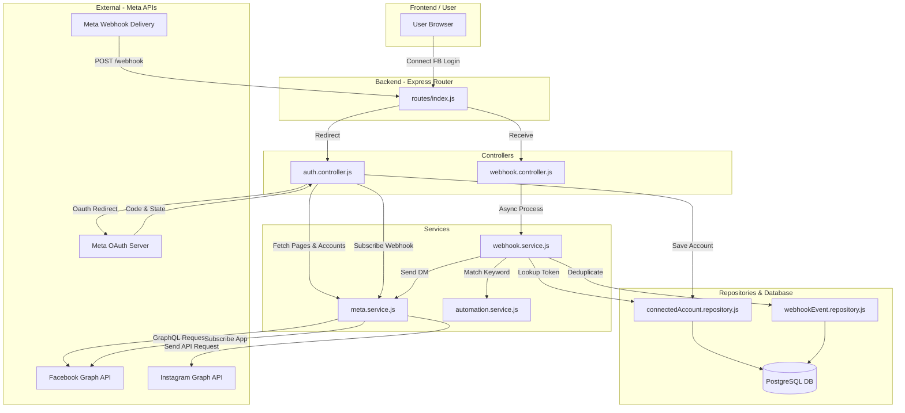

# Instagram Automation Backend Architecture Diagnosis

This report presents a thorough architectural diagnosis of the InstaAutomate backend system. It details the analysis of API usage, ID lifecycles, and database structures, identifies mixed architectures, and outlines a migration plan to achieve a pure **Instagram Login Only** system.

---

## Phase 1 — Project Analysis

The codebase contains two parallel flows for user authentication and account connection: the **Facebook Login Flow** and the **Instagram Login Flow**.

### Architecture Overview



### Flow Breakdown

1. **Authentication Flow**:
   - The user connects an account through the dashboard. There are two entry points:
     - **Facebook Login Flow**: `/auth/login` -> Facebook Dialog -> `/auth/callback`.
     - **Instagram Login Flow**: `/auth/ig-token` -> Instagram Dialog -> `/auth/ig-token/callback`.
   - The dashboard frontend (`index.html`) relies on the **Instagram Login Flow** via `connectInstagram()`.

2. **OAuth Flow(s)**:
   - **Facebook Login**: Redirects to `www.facebook.com/.../dialog/oauth`. Exchanges the authorization code for a Facebook User Access Token, fetches user pages (`/me/accounts`), retrieves associated `instagram_business_account.id` and page tokens, and stores them.
   - **Instagram Login**: Redirects to `www.instagram.com/oauth/authorize`. Exchanges the code at `api.instagram.com/oauth/access_token` for a short-lived token, swaps it for a long-lived Instagram User Access Token at `graph.instagram.com/access_token`, and stores it in the database.

3. **Webhook Registration Flow**:
   - **Facebook Login**: Handled programmatically during OAuth callback by calling `subscribeAppToIG()`, which sends a `POST` request to `/{page-id}/subscribed_apps` with `subscribed_fields: "feed"` using the Facebook Page Access Token.
   - **Instagram Login**: No programmatic webhook subscription is executed in `igTokenCallback`. The app expects manual setup or relies on the broken `/admin/subscribe/:instagramId` endpoint.

4. **Webhook Processing Flow**:
   - Endpoint `POST /webhook` immediately returns `200 OK` (with `"EVENT_RECEIVED"`) to prevent timeout retries from Meta, then processes the payload asynchronously using `setImmediate()`.
   - `webhook.service.js` parses the changes array. For comment events, it deduplicates the event via the `webhook_events` table (checking `eventId`).
   - Looks up the `ConnectedAccount` via the sender's Instagram ID.
   - Evaluates active automations via `findMatchingAutomation()` to find keyword matches.
   - If a match is found, it sends an automated DM to the commenter via `metaService.sendDM()` using the decrypted stored token.

5. **Meta API Usage**:
   - The system utilizes both the **Facebook Graph API** (to manage pages, check/register webhook subscriptions, and debug tokens) and the **Instagram Graph API** (to fetch profile details and send messages).

6. **Database Schema**:
   - Stored in a PostgreSQL database using Prisma (managed via [schema.prisma](file:///c:/Users/srish/Downloads/ig-automation-v2/backend/prisma/schema.prisma)). The tables include `users`, `connected_accounts`, `automations`, `webhook_events`, and `sent_dms`.

7. **Token Storage**:
   - Encrypted at rest using AES-256-GCM via `utils/encryption.js` inside the `connected_accounts` table (`pageAccessToken` and `userAccessToken`).

8. **Instagram ID Storage**:
   - Saved under the `instagramId` column in `connected_accounts`. However, what is saved depends on the flow: the **Instagram Business Account ID** (Facebook flow) or the **Instagram User ID** (Instagram flow).

9. **Automation Pipeline**:
   - Uses `automations` and `sent_dms` tables. It queries rules, performs case-insensitive normalization and matching (`EXACT`, `CONTAINS`, `STARTS_WITH`), and records sent DMs to prevent duplicates.

---

## Phase 2 — API Classification

| Endpoint | Purpose | Architecture | Correct / Incorrect |
| :--- | :--- | :--- | :--- |
| `https://www.facebook.com/v25.0/dialog/oauth` | Initiate User Login & Request Permissions | Facebook Login | Correct (Facebook Flow) |
| `https://www.instagram.com/oauth/authorize` | Initiate direct Instagram Authentication | Instagram Login | Correct (Instagram Flow) |
| `https://api.instagram.com/oauth/access_token` | Exchange authorization code for short token | Instagram Login | Correct (Instagram Flow) |
| `https://graph.instagram.com/access_token` | Exchange short token for long-lived token | Instagram Login | Correct (Instagram Flow) |
| `https://graph.instagram.com/v25.0/me` | Fetch Instagram Profile information | Instagram Login | Correct (Instagram Flow) |
| `https://graph.instagram.com/v25.0/me` (requesting `instagram_business_account_id`) | Attempt to fetch Linked Business Account ID | Instagram Login | **Incorrect API usage** (Node does not support this field) |
| `https://graph.facebook.com/v25.0/{instagramId}` | Fetch Instagram Business Account details | Facebook Login | Correct (Facebook Flow) |
| `https://graph.facebook.com/v25.0/{pageId}/subscribed_apps` | Subscribe app to Page webhook events | Facebook Login | Correct (Facebook Flow) |
| `https://graph.facebook.com/v25.0/debug_token` | Inspect user token scopes | Facebook Login | Correct (Facebook Flow) |
| `https://graph.facebook.com/v25.0/me/accounts` | Fetch Facebook pages managed by user | Facebook Login | Correct (Facebook Flow) |
| `https://graph.instagram.com/v25.0/me/messages` | Send DM to commenter | Instagram Login | **Incorrect Token & Call Mismatch** (See explanation below) |

### API Classification Explanations

- **`graph.instagram.com/v25.0/me` (with `instagram_business_account_id` field)**: This is incorrect. The field `instagram_business_account_id` belongs to the Facebook Graph API's `/me/accounts` node (representing Pages that link to Instagram business accounts). The `me` node on `graph.instagram.com` represents the authenticated Instagram account itself; it does not contain a field named `instagram_business_account_id`.
- **`graph.instagram.com/v25.0/me/messages`**: The endpoint itself belongs to the **Instagram Platform API with Instagram Login** (Instagram Login for Business). However, in the codebase:
  1. In the **Facebook Login** flow, the token passed is a **Facebook Page Access Token**. But `graph.instagram.com` only accepts **Instagram User Access Tokens**. Calling this endpoint with a Page Access Token will result in an OAuth verification error.
  2. For the **Facebook Login** flow, the correct endpoint to send messages is `https://graph.facebook.com/v25.0/me/messages` (the Messenger API for Instagram) using the Page Access Token.

---

## Phase 3 — Mixed Architecture Detection

Yes, the project is mixing the **Instagram Login** and **Facebook Login** architectures. The following file-by-file analysis outlines the conflicts:

### 1. File: [auth.controller.js](file:///c:/Users/srish/Downloads/ig-automation-v2/backend/src/controllers/auth.controller.js)
* **Conflict**: Exposes endpoints for both flows (`login` + `callback` for Facebook Login; `igTokenLogin` + `igTokenCallback` for Instagram Login).
* **Incorrect Function / Call**: 
  - `igTokenCallback` lines 194-201:
    ```javascript
    try {
      const webhookIdRes = await axios.get(`https://graph.instagram.com/v25.0/me`, {
        params: { fields: "id,instagram_business_account_id", access_token: longToken },
      });
      webhookInstagramId = webhookIdRes.data.instagram_business_account_id || null;
    }
    ```
    This is incorrect because `instagram_business_account_id` is not a field supported by `graph.instagram.com/v25.0/me`.
* **Incorrect Token/ID Storage**:
  - `igTokenCallback` lines 203-209:
    ```javascript
    const account = await connectedAccountRepo.upsertFromIg({
      userId,
      instagramId: igUserId,
      webhookInstagramId,
      instagramUsername: igUsername,
      accessToken: longToken,
    });
    ```
    It writes the Instagram User Access Token into both `pageAccessToken` and `userAccessToken` columns in the database. This is a hack to adapt the Instagram Login token into a schema built for Facebook Page tokens.

### 2. File: [meta.service.js](file:///c:/Users/srish/Downloads/ig-automation-v2/backend/src/services/meta.service.js)
* **Conflict**: Functions like `fetchUserPages()`, `subscribeAppToIG()`, and `checkSubscription()` execute calls to `graph.facebook.com` requiring Facebook Page Access Tokens. However, `sendDM()` calls `graph.instagram.com/v25.0/me/messages`.
* **Incorrect Function / Call**: 
  - `sendDM()` lines 74-81:
    ```javascript
    const res = await axios.post(
      `https://graph.instagram.com/v25.0/me/messages`,
      {
        recipient: { id: recipientIgUserId },
        message: { text: messageText },
      },
      { params: { access_token: pageAccessToken } }
    );
    ```
    If the account was connected via **Facebook Login**, `pageAccessToken` is a Facebook Page token. The call will fail on `graph.instagram.com` because it expects an Instagram User Access Token. Conversely, if connected via **Instagram Login**, the functions `subscribeAppToIG` and `checkSubscription` will fail because they point to `graph.facebook.com` nodes representing Facebook Pages, whereas the account has no associated Facebook Page or Page Token.

### 3. File: [webhook.service.js](file:///c:/Users/srish/Downloads/ig-automation-v2/backend/src/services/webhook.service.js)
* **Conflict**: Resolving the account relies on `findByInstagramId(instagramId)`.
* **Incorrect Logic / Field**:
  - Webhook entry `entry[].id` in Meta webhooks is the **Instagram Business Account ID** (an ID starting with `1784...`).
  - In the Facebook Login flow, `instagramId` is saved as the Instagram Business Account ID. The lookup succeeds directly.
  - In the Instagram Login flow, the database `instagramId` is populated with `igUserId` (the Instagram User ID from `/me`). Since `igUserId` does not match the webhook's `instagramId`, the developer added a fallback:
    ```javascript
    const byWebhookId = await db.connectedAccount.findFirst({
      where: { webhookInstagramId: instagramId, isActive: true }
    });
    ```
    However, because the `webhookInstagramId` column is populated with `instagram_business_account_id` from `graph.instagram.com/me` (which always returns `null`), `webhookInstagramId` is saved as `null` in the DB. As a result, the fallback fail, making the system unable to process webhooks for Instagram Login users.

### 4. File: [admin.controller.js](file:///c:/Users/srish/Downloads/ig-automation-v2/backend/src/controllers/admin.controller.js)
* **Incorrect Function / Call**:
  - `resubscribe()` line 125:
    ```javascript
    const result = await metaService.subscribeAppToIG(instagramId, account.pageAccessToken, reqId);
    ```
    The function signature is `subscribeAppToIG(pageId, instagramId, pageAccessToken, reqId)`. The arguments are misaligned: `instagramId` is passed as `pageId`, the token as `instagramId`, and `reqId` as the token. This causes a crash or API error.
  - Furthermore, it targets the Facebook Page subscription endpoint, which is unsupported for Instagram Login only accounts.

---

## Phase 4 — ID Analysis

| Identifier | Origin | Returning API | Instagram-scoped | Facebook-scoped | Page-scoped | Media-scoped | Official Mapping / Relation |
| :--- | :--- | :--- | :--- | :--- | :--- | :--- | :--- |
| **OAuth ID** | OAuth redirect payload | `api.instagram.com` OR `graph.facebook.com` | Yes (IG Login) | Yes (FB Login) | No | No | No direct mapping exists between a Facebook User ID and an Instagram User ID. |
| **Webhook `entry.id`** | Incoming Webhook body | Meta Webhooks engine | Yes | No | No | No | Represents the Instagram Business Account ID. Matches `instagramId` (FB) or `webhookInstagramId` (IG). |
| **`recipient.id`** | Incoming Webhook `changes[].value` | Meta Webhooks engine | Yes | No | Yes (FB Flow) | No | The ID of the commenter. In Facebook flow, it is Page-scoped. In Instagram flow, it is App-scoped. No cross-app mapping exists. |
| **`instagram_business_account.id`**| OAuth Page query | `graph.facebook.com/me/accounts` | Yes | No | No | No | Directly linked 1-to-1 with a Facebook Page ID. |
| **Page ID** | OAuth Page query | `graph.facebook.com/me/accounts` | No | Yes | Yes | No | Associated with the Instagram Business Account ID. Absent in Instagram Login. |
| **Media ID** | Webhook comment value | Meta Webhooks engine | Yes | No | No | Yes | Scoped to the Instagram Media post. |
| **Comment ID** | Webhook comment value | Meta Webhooks engine | Yes | No | No | No | Scoped to the Comment object under the Media. |
| **Database ID** | Database layer | Prisma Client (`cuid()`) | No | No | No | No | Internal primary keys (`id`) mapped for relational integrity. |

---

## Phase 5 — Webhook Analysis

### Are subscriptions registered correctly?
- **For Facebook Login**: Yes. Subscriptions are registered programmatically in `auth.controller.js` callback (line 104) calling `subscribeAppToIG()` which posts to `/{page-id}/subscribed_apps` with `subscribed_fields: "feed"`.
- **For Instagram Login**: **No**. No subscription call is executed in `igTokenCallback`. The `/admin/subscribe/:instagramId` endpoint is broken due to misaligned parameters and uses the wrong base URL (`graph.facebook.com` instead of `graph.instagram.com`).

### Webhook Metadata
- **Which API performs the subscription?**
  - **Facebook Login**: Facebook Graph API (`graph.facebook.com`).
  - **Instagram Login**: Instagram Graph API (`graph.instagram.com`).
- **Which token is used?**
  - **Facebook Login**: Facebook Page Access Token.
  - **Instagram Login**: Instagram User Access Token (long-lived).
- **Which endpoint is used?**
  - **Facebook Login**: `POST https://graph.facebook.com/v25.0/{page-id}/subscribed_apps`
  - **Instagram Login**: `POST https://graph.instagram.com/v25.0/me/subscribed_apps`
- **Does the implementation match Meta's official documentation?**
  - **Facebook Login**: Yes. It follows the standard pattern for subscribing to Page feeds to receive linked Instagram comments.
  - **Instagram Login**: No. It targets the Facebook endpoint with the wrong arguments and does not run during authentication.

---

## Phase 6 — Messaging Analysis

The function `sendDM()` is analyzed below:

1. **Which API is used**:
   - `POST https://graph.instagram.com/v25.0/me/messages` (Instagram Graph API).

2. **Which access token is expected**:
   - The parameter name is `pageAccessToken`. In execution, this is `connectedAccount.userAccessToken || connectedAccount.pageAccessToken`.

3. **Which architecture the endpoint belongs to**:
   - The endpoint belongs to the **Instagram Platform API with Instagram Login** (Instagram Login for Business).

4. **Whether it matches the authentication architecture**:
   - **Facebook Login Accounts**: **No**. It passes a Facebook Page Access Token to a `graph.instagram.com` endpoint. This mismatch causes a verification failure. For Facebook Login, it must call `https://graph.facebook.com/v25.0/me/messages` (Messenger API for Instagram) using the Page Access Token.
   - **Instagram Login Accounts**: **Yes**. It passes the Instagram User Access Token to `graph.instagram.com/me/messages`, which matches the authentication architecture.

---

## Phase 7 — Database Analysis

### Schema Assumptions in `schema.prisma`
The `ConnectedAccount` model makes several Page-based assumptions:
```prisma
model ConnectedAccount {
  id                String   @id @default(cuid())
  userId            String
  pageId    String?  @unique    // Assumes Facebook Page
  pageName  String?             // Assumes Facebook Page
  instagramId       String   @unique
  instagramUsername String?
  pageAccessToken   String      // Assumes Facebook Page Access Token
  userAccessToken   String?     // Added to store Instagram Login Token
  webhookInstagramId String?    // Hack to link mismatched User IDs
  ...
}
```
- It assumes a Facebook Page exists (`pageId`, `pageName`, `pageAccessToken`).
- In an Instagram Login only architecture, these fields are irrelevant and will remain `null`.

### Recommended Schema for Instagram Login Only
To clean up the schema for Instagram Login only:

```prisma
model ConnectedAccount {
  id                String   @id @default(cuid())
  userId            String
  instagramId       String   @unique // Store the Instagram User ID (from /me)
  instagramUsername String?
  accessToken       String   // Encrypted Instagram User Access Token (long-lived)
  tokenExpiresAt    DateTime? // Optional: track token expiry
  connectedAt       DateTime @default(now())
  updatedAt         DateTime @updatedAt
  isActive          Boolean  @default(true)

  automations Automation[]

  @@index([userId])
  @@map("connected_accounts")
}
```

---

## Phase 8 — Desired Architecture

### Is "Instagram Login ONLY" achievable using Meta's official APIs?
**Yes.** Under recent Meta Graph API versions (v20.0+), Meta officially supports **Instagram Login for Business** (Instagram Platform API with Instagram Login), allowing professional accounts (Business or Creator) to authenticate directly without the Facebook Login UI.

### Required Architecture

```
User
  │ (Clicks "Connect Instagram")
  ▼
Redirect to: https://www.instagram.com/oauth/authorize
  ├── platform_app_id = IG_APP_ID
  ├── redirect_uri = IG_REDIRECT_URI
  └── scopes = instagram_business_basic, instagram_business_manage_messages, instagram_business_manage_comments
  │
  ▼
Callback exchanges code for Instagram User Access Token (long-lived)
  │
  ▼
Get profile: GET https://graph.instagram.com/v25.0/me (Returns Instagram User ID)
  │
  ▼
Subscribe Webhook: POST https://graph.instagram.com/v25.0/me/subscribed_apps
  ├── access_token = Instagram User Access Token
  └── subscribed_fields = comments, messages
  │
  ▼
Incoming Webhook POST /webhook
  ├── entry[].id matches stored Instagram User ID (no fallbacks needed)
  └── value.commenter_id / value.from.id contains the commenter's ID
  │
  ▼
Send DM: POST https://graph.instagram.com/v25.0/me/messages
  ├── access_token = Instagram User Access Token
  └── recipient.id = commenter's ID
```

---

## Phase 9 — Migration Report

### 1. Files to Delete
- None.

### 2. Files to Rewrite / Modify
- **[config/index.js](file:///c:/Users/srish/Downloads/ig-automation-v2/backend/src/config/index.js)**:
  - Remove Facebook-specific env requirements (like `APP_ID`, `APP_SECRET`, `REDIRECT_URI`). Keep `IG_APP_ID`, `IG_APP_SECRET`, and `IG_REDIRECT_URI`.
  - Update `graphBase` to `https://graph.instagram.com`.
- **[routes/index.js](file:///c:/Users/srish/Downloads/ig-automation-v2/backend/src/routes/index.js)**:
  - Remove Facebook-specific OAuth routes: `GET /auth/login` and `GET /auth/callback`.
  - Set `GET /auth/ig-token` and `GET /auth/ig-token/callback` as the primary OAuth flow (optionally rename them to `/auth/login` and `/auth/callback`).
- **[controllers/auth.controller.js](file:///c:/Users/srish/Downloads/ig-automation-v2/backend/src/controllers/auth.controller.js)**:
  - Remove `login` and `callback` functions.
  - Rewrite `igTokenCallback` to programmatically subscribe to webhooks on successful authentication.
- **[services/meta.service.js](file:///c:/Users/srish/Downloads/ig-automation-v2/backend/src/services/meta.service.js)**:
  - Rewrite `subscribeAppToIG` and `checkSubscription` to point to `graph.instagram.com/v25.0/me/subscribed_apps` using the Instagram User Access Token.
  - Remove Facebook-specific functions: `fetchUserPages()`, `debugToken()`, and `exchangeCodeForToken()` (since OAuth code exchange is handled directly in the controller).
  - Update `sendDM` to explicitly expect the Instagram User Access Token.
- **[services/webhook.service.js](file:///c:/Users/srish/Downloads/ig-automation-v2/backend/src/services/webhook.service.js)**:
  - Remove the fallback logic querying `webhookInstagramId`. The webhook payload `entry[].id` will match the `instagramId` stored in the database.
- **[repositories/connectedAccount.repository.js](file:///c:/Users/srish/Downloads/ig-automation-v2/backend/src/repositories/connectedAccount.repository.js)**:
  - Remove `upsert` (Facebook flow) and `findByPageId`. Update `upsertFromIg` to match the cleaned schema.

### 3. Database Fields to Remove
- `pageId` from `connected_accounts` table.
- `pageName` from `connected_accounts` table.
- `webhookInstagramId` from `connected_accounts` table.
- `pageAccessToken` from `connected_accounts` table.

### 4. Database Fields to Add
- `accessToken` in `connected_accounts` table (to store the long-lived Instagram token).
- `tokenExpiresAt` (optional).

### 5. API Endpoints to Replace
- Replace `POST https://graph.facebook.com/v25.0/{page-id}/subscribed_apps` with `POST https://graph.instagram.com/v25.0/me/subscribed_apps`.
- Remove all `graph.facebook.com` queries. All queries must target `graph.instagram.com`.

### 6. Risk Assessment & Effort
- **Risk**: Highly minor. Since the Next.js frontend is a boilerplate, there is no UI risk.
- **Migration Effort**: Small (estimated 4-8 engineering hours). Requires rewriting routes/services, dropping DB columns, and updating the webhook configuration in the Meta Developer Console (adding the **Instagram** product and subscribing to `comments` and `messages`).

---

## Phase 10 — Final Verdict

### 1. Is the current architecture internally consistent?
> [!WARNING]
> **No.** The current codebase is in a broken, hybrid state. It attempts to manage database structures and routes designed for Facebook Login (using Page Tokens and Page IDs) while executing API actions (such as `sendDM` and frontend redirection) tailored to Instagram Login.

### 2. Is it mixing Meta authentication systems?
> [!IMPORTANT]
> **Yes.** It mixes **Facebook Login for Business** (Facebook Page tokens, Facebook Graph endpoints) with **Instagram Login for Business** (Instagram User tokens, Instagram Graph endpoints), leading to silent credential failures, database misalignments, and non-functional webhook subscriptions.

### 3. Is the ID mismatch caused by my code or Meta's API design?
> [!NOTE]
> **Your code.** The ID mismatch occurs because `igTokenCallback` incorrectly tries to fetch the field `instagram_business_account_id` from the `graph.instagram.com/me` node (which does not exist). The code then stores the Instagram User ID as `instagramId` and saves `webhookInstagramId` as `null`, causing webhook lookups in `webhook.service.js` to fail.

### 4. Can this project realistically support Instagram Login only?
> [!TIP]
> **Yes.** Using Meta's updated **Instagram Platform API with Instagram Login** (Instagram Login for Business), you can run a pure Instagram Login flow without a Facebook Login UI, and successfully receive comments webhooks and send DMs.

### 5. If yes, exactly what needs to change?
1. Clean up `prisma/schema.prisma` to keep only the Instagram account fields and a single `accessToken` field.
2. Update all calls in `meta.service.js` to target `https://graph.instagram.com` instead of `https://graph.facebook.com`.
3. Align parameters in `subscribeAppToIG` and invoke it in `igTokenCallback` using `POST graph.instagram.com/v25.0/me/subscribed_apps`.
4. Clean up `webhook.service.js` to perform direct lookups on `instagramId` (since `entry[].id` in webhooks will match the stored Instagram User ID).
5. Clean up environment variables and Meta Developer Console settings to enable the **Instagram** product and direct subscriptions.
